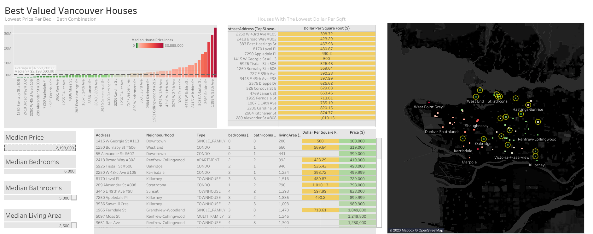

# Analysis of Vancouver Houses to Search for the Best-Valued House

  

## Table of Contents

- [Introduction](#introduction)
- [Data Gathering](#data-gathering)
- [Data Cleaning](#data-cleaning)
- [Database](#database)
- [Tableau](#tableau)
- [Conclusion](#conclusion)

## Introduction

The objective of the personal project is to analyze the best-valued houses in Vancouver from Zillow listings. The process involved data gathering through web scraping and utilizing open source data, data cleaning, setting up a BigQuery database and creating a dashboard on Tableau. The report is in these main four sections: data gathering, cleaning, setting up the BigQuery database and dashboard creation on Tableau. I scraped housing data from Zillow and analyzed it to identify the best-valued houses in Vancouver. I also gathered data from Vancouver Open Data Portal to determine neighbourhood names. The project involved multiple steps, including data cleaning, filling in missing values, setting up a database, and visualizing the data using Tableau. In this report, I will detail each step of the project and the challenges I faced.

## Data Gathering

The first step was to scrape housing data from Zillow using Python and Beautiful Soup. However, I encountered an issue: I could only get the property details of nine houses out of forty on the first page. Since BeautifulSoup can only scrape static items, I could not gather all the data I needed. Fortunately, all the information I needed was in a script tag with an HTML comment in JSON format. The alternative solution to this challenge was to learn and utilize the Python package Selenium which can get dynamically loaded items.

The other data that I used was local area boundary data from Vancouver Open Data. This dataset is a Shapely file, and the neighbourhood coordinates were in a Polygon structure. With the Python package Nomatim, I used the OpenStreetMap API to determine the coordinates based on the addresses. I obtained each address's neighbourhood name by searching for the coordinates of each Polygon.

## Data Cleaning

Once I scraped the data, I cleaned it by removing irrelevant columns and filling in missing values. I dealt with multiple issues, such as expanding the hdp (homes detail page) data column, dealing with missing coordinates, filling in missing neighbourhood names, and assigning brokerage information. The hdp column consisted of a string of information in a dictionary structure for each row. I also had to manually enter some data that the loop could not process, such as two addresses that threw an error and another two that were missing latitude and longitude. Additionally, I found one address classified as a lot, which I removed. The last issue was a single-family house with no living area square footage listed online. Further investigation led to the discovery that the house was not built and was classified wrong as a single-family residence when it was supposed to be lot.

## Database

After cleaning the data, I set up a BigQuery database to store and manage the data. However, I ran into an issue with access permission, which I resolved by changing the service account role to the owner. I created different relations and keys, such as the primary and foreign keys, to establish relationships between the tables. However, I found that primary and foreign keys are not supported on BigQuery since it is an OLAP (Online Analytical Processing) technology.

After setting up the database, I wrote seven queries to investigate:

1. Top 5 lowest $/sq ft per neighbourhood
2. Top 3 highest prices per neighbourhood
3. Top 3 lowest prices per neighbourhood
4. Brokerage and the total number of units they list, average price, number of neighbourhoods
5. Top 3 bathrooms or bedroom / sq ft
6. Average price, count of houses in each neighbourhood
7. Lowest price per bedroom, bathroom combination

After writing these queries, I exported each into a separate CSV file to use in Tableau. Since I only have access to Tableau Public, I couldn't connect to BigQuery directly.

## Tableau:

Finally, I visualized the data using Tableau. I created multiple visualizations to analyze the data, such as bar plots, cards, maps and tables. After plotting each house on the map, I noticed that one of the houses was outside Vancouver. I fixed this issue to ensure accuracy in the analysis. I also used conditional formatting, as learned from the resource at https://hevodata.com/learn/tableau-conditional-formatting/, to utilize colour to highlight the information better.

While connecting to the data source, I encountered an error. After watching this video: https://www.youtube.com/watch?v=yeHdIlgTwDg that unchecking the data interpreter in the data source solved the problem, which had previously caused some of the column header names to become distorted.

I used the information at https://help.tableau.com/current/pro/desktop/en-us/joining_tables.htm to join multiple files to obtain latitude and longitude data for the data points that depict the lowest dollar per square foot.

The dashboard I created follows a Z formation. The first visual is a bar graph showing addresses with the lowest price for each combination of bedrooms and bathrooms. To highlight the discrepancy between the median and the average house prices, I included a reference line with a median of $2,198,000 and another reference line with the average price. The average is greater than the median by about $2,000,000. Means are not robust to outliers and, due to the more expensive housing in Vancouver, it increased the average by a lot.

The second visual is a table containing the addresses from the first graph, but with only the houses with the lowest dollar per square foot. I wrote a query to determine the places of each neighbourhood with the top five cheapest dollars per square foot. To highlight the dollar per square foot in the map, I used the colour yellow, which is consistent with the colour of the corresponding field in the table.

The third visual is a map of Vancouver, with the squares representing the houses and colours depicting the price on the median house index. For example, red houses represent prices above the median, and the darker the red, the pricier. The same concept applies to green, with darker green representing prices below the median. The yellow circle represents the houses with the lowest dollar per square foot, which signifies the best-valued houses.

The fourth visual consists of cards displaying the median price, number of bedrooms, bathrooms, and living area. Based on this information, the median house type would be single/multi-family residences.

The last visual is a table consisting of all the information of all the addresses from the first graph, including the dollar per square foot but only for the houses with the lowest depicted in yellow. The price column is shaded from green to red according to the median house price index.

The visualizations helped me identify the best-valued houses in Vancouver based on the lowest price of each bedroom and bathroom combination with the dollar-per-square-foot attribute.

## Conclusion:

In conclusion, this personal project involved multiple steps, including web scraping, data cleaning, database management, and data visualization. I encountered many challenges: dealing with missing values and setting up the database. However, the project helped me improve my abilities in Python and learn about BigQuery and Tableau. It also allowed me to identify the best-valued houses in Vancouver based on various criteria, which could be invaluable for anyone looking to buy or sell a home.
